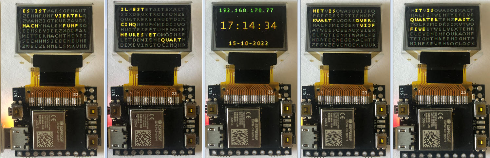
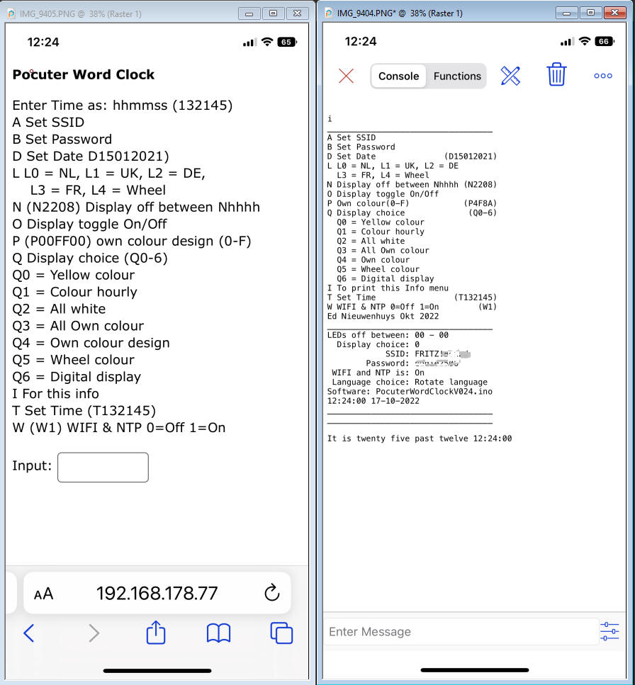
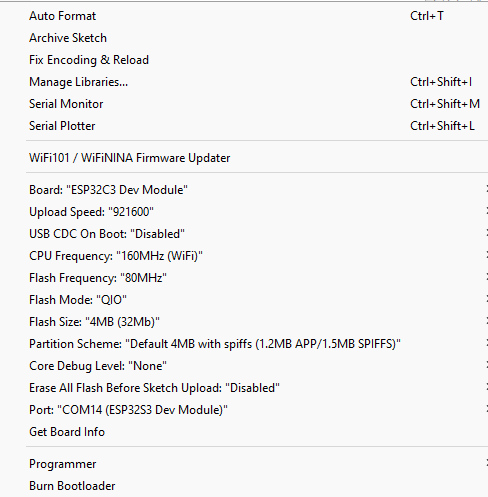

# Pocuter-Wordwatch
Wordwatch on Pocuter (ESP32-C3) with UART BLE connection 

ESP32-C3 Pocuter Word clock

A small watch that displays the time in words in Dutch, English, French and 
German or digital on a tiny display. The watch is able to receive the time 
via NTP from the internet. Settings can be controled via a webpage on a mobile 
or PC but also with Bluetooth LE. If the watch is used stand-alone without 
connections it can be controlled with buttons.   

The watch is built on a Pocuter One with a ESP32-C3 chip and OLED display 
built by <a href="https://www.pocuter.com/pocuter-one">www.pocuter.com</a> 
The software is written in the Arduino IDE 1.8.19 and IDE 2.0.0  The 
software contains coding to use the: 1 Pocuter One with 96x64 pixels OLED colour display 
and the use of fonts 2 BLE nRF UART connection  3 Buttons 4 RGB 
LED 5 RTC for time 6 EEPROM storage of a struct with settings 8 Menu driven with serial monitor, BLE and WIFI-html page 9 
Get time with NTP server via WIFI 10 Use of menu's to control the word clock 
 <strong>First Use</strong> If the clock is connected to the internet it 
will seek contact with a time server. The Timezone is set to UTC+1 Amsterdam 
To set the name of your WIFI network a SSID and password must be entered. 
There are a few methods: - Connect the Pocuter with a serial cable to a PC 
and use a serial terminal. I use the Arduino IDE or Termite as serial terminal 
- USE the BLE connection with a UART serial terminal app. For IOS:&nbsp;
<a href="https://apps.apple.com/nl/app/ble-serial-pro/id1632245655?l=en">BLE 
Serial Pro</a> For android:  In both cases use the menu and enter AMy-SSID 
and send BMy password These settings are 
stored in EEPROM. Keep in mind that the EEPROM content is cleared after an 
upload of the program into the Pocuter.. - In the source code in the void 
setup() just above&nbsp; StartWIFI_NTP();&nbsp;  &nbsp;&nbsp;&nbsp; strcpy(Mem.ssid,"My-SSID");
 &nbsp;&nbsp;&nbsp; strcpy(Mem.password,"My 
password");  &nbsp;&nbsp;&nbsp; 
StartWIFI_NTP();&nbsp;&nbsp; Tekstprintln("WIFI started");&nbsp;&nbsp;&nbsp; // 
Start WIFI and NTP  

<strong>Control and settings of the clock</strong>

With the buttons on the Pocuter the time and display mode can be set Top 
Left: + 1 hour 
Right bottom: + 1 minute Top Right: Toggle between word or digital display 

 With the WIFI webpage or BLE UART terminals the clock can be controlled 
The settings are set by entering the first letter from the menu following by 
parameters if necessary.  For example: To set the colours of the fonts in the display 
to white enter: Q2 To change the SSID name and Password of the connection 
to the router. For example enter: AFRITZBox and enter Bsecretpassword. 
 In the BLE connection the SSID and password will be shown.  Standard will it 
be set to SSID =&nbsp; Guest and Password = Guest-001 

 
BLE connection can be made with my app
<a href="https://ednieuw.home.xs4all.nl/BLESerial/BLESerialPRO.html">BLE Serial 
pro</a> on the
<a href="https://apps.apple.com/nl/app/ble-serial-pro/id1632245655?l=en">app 
store</a> for Apple IOS devices.  For Android
<a href="https://play.google.com/store/apps/details?id=com.nordicsemi.nrfUARTv2&amp;hl=en&amp;gl=US"> 
&nbsp;nRF UART terminal program </a>and
<a href="https://play.google.com/store/apps/details?id=de.kai_morich.serial_bluetooth_terminal">
Serial Bluetooth terminal from Kai Morich</a> Unfortunately these Android 
apps can/do not read strings longer than 20 characters.   
 Left the HTML page and 
on the right the BLE menu  Because not all 
Pocuter functionalities in the Pocuter library were described or could be found 
by me at the moment of writing this program several standard ESP32-C3 DEV 
functionality was used. In this software version I only used the Pocuter 
Button and OLED 
screen functionality.   Settings 
are stored in EEPROM,  The following libraries are used:

<pre>#include &lt;Pocuter.h&gt;
#include &lt;NimBLEDevice.h&gt;      // For BLE communication  https://github.com/h2zero/NimBLE-Arduino
#include &lt;EEPROM.h&gt;            // Used for EEPROM storage of the word clock settings 
#include &lt;ESPNtpClient.h&gt;      // https://github.com/gmag11/ESPNtpClient
#include &lt;WiFi.h&gt;              // Used for NTP tme and web page
#include &lt;AsyncTCP.h&gt;          // Used for webpage   https://github.com/me-no-dev/ESPAsyncWebServer
#include &lt;ESPAsyncWebServer.h&gt; // Used for webpage   https://github.com/me-no-dev/ESPAsyncWebServer</pre>

To compile the software some standard setting must be changed.  First copy 
the Pocuter libraries in the libraries folder where your sketches are saved.  In my 
case copy from here: c:\Program Files (x86)\Arduino\libraries\Pocuter\ to here 
<a href="file:///c:/Users/ednie/Documents/Files/Arduino/libraries/Pocuter/">c:\Users\ednie\Documents\Files\Arduino\libraries\Pocuter\</a> 
Now we do not change the original Pocuter library and we keep all the 
non-standard Arduino libraries in one place.

To be able to compile the esp32 Arduino boards must be installed and the 
ESP32 C3 DEV board selected

 

Two changes must be made in the file: 
"C:\Users\ednie\Documents\Files\Arduino\libraries\Pocuter\include\PocuterLibConfig.h" 
To avoid the Pocuter resets, when writing inside a loop to the OLED-screen, 
disable the SD-Card. This is probably a temporary bug but for now you have to 
disable the SD-card Remove the // before #define POCUTER_DISABLE_SD_CARD 
Because we do not use the pocuter WIFI library we have to disable the WIFI to 
avoid a compilation error of the ESP32 library. So remove the // before 
#define POCUTER_DISABLE_WIFI

<pre>/* Dont use SD-Card functions. This includes OTA */
 #define POCUTER_DISABLE_SD_CARD

/* Dont use WIFI functions */
 #define POCUTER_DISABLE_WIFI</pre>

&nbsp;

<pre>Successfully created esp32c3 image.
"C:\\Users\\ednie\\AppData\\Local\\Arduino15\\packages\\esp32\\hardware\\esp32\\2.0.5/tools/gen_esp32part.exe" -q "C:\\Users\\ednie\\AppData\\Local\\Temp\\arduino_build_470814/partitions.csv" "C:\\Users\\ednie\\AppData\\Local\\Temp\\arduino_build_470814/PocuterWordClockV034.ino.partitions.bin"
Multiple libraries were found for "Pocuter.h"
 Used: C:\Users\ednie\Documents\Files\Arduino\libraries\Pocuter
 Not used: C:\Program Files (x86)\Arduino\libraries\Pocuter
Multiple libraries were found for "WiFi.h"
 Used: C:\Users\ednie\AppData\Local\Arduino15\packages\esp32\hardware\esp32\2.0.5\libraries\WiFi
 Not used: C:\Users\ednie\Documents\Files\Arduino\libraries\WiFiNINA
 Not used: C:\Program Files (x86)\Arduino\libraries\WiFi
Using library Pocuter in folder: C:\Users\ednie\Documents\Files\Arduino\libraries\Pocuter (legacy)
Using library NimBLE-Arduino at version 1.4.0 in folder: C:\Users\ednie\Documents\Files\Arduino\libraries\NimBLE-Arduino 
Using library EEPROM at version 2.0.0 in folder: C:\Users\ednie\AppData\Local\Arduino15\packages\esp32\hardware\esp32\2.0.5\libraries\EEPROM 
Using library ESPNTP in folder: C:\Users\ednie\Documents\Files\Arduino\libraries\ESPNTP (legacy)
Using library WiFi at version 2.0.0 in folder: C:\Users\ednie\AppData\Local\Arduino15\packages\esp32\hardware\esp32\2.0.5\libraries\WiFi 
Using library Ticker at version 2.0.0 in folder: C:\Users\ednie\AppData\Local\Arduino15\packages\esp32\hardware\esp32\2.0.5\libraries\Ticker 
Using library AsyncTCP-master at version 1.1.1 in folder: C:\Users\ednie\Documents\Files\Arduino\libraries\AsyncTCP-master 
Using library ESPAsyncWebServer-master at version 1.2.3 in folder: C:\Users\ednie\Documents\Files\Arduino\libraries\ESPAsyncWebServer-master 
Using library FS at version 2.0.0 in folder: C:\Users\ednie\AppData\Local\Arduino15\packages\esp32\hardware\esp32\2.0.5\libraries\FS 
"C:\\Users\\ednie\\AppData\\Local\\Arduino15\\packages\\esp32\\tools\\riscv32-esp-elf-gcc\\gcc8_4_0-esp-2021r2-patch3/bin/riscv32-esp-elf-size" -A "C:\\Users\\ednie\\AppData\\Local\\Temp\\arduino_build_470814/PocuterWordClockV034.ino.elf"
Sketch uses 1219946 bytes (38%) of program storage space. Maximum is 3145728 bytes.
Global variables use 43900 bytes (13%) of dynamic memory, leaving 283780 bytes for local variables. Maximum is 327680 bytes.

</pre>

&nbsp;

Some lessons learned:

Use&nbsp;&nbsp; pocuter-&gt;begin(PocuterDisplay::BUFFER_MODE_DOUBLE_BUFFER);
 Use USBSerial instead of USBSerial.&nbsp; Serial,print is USBSerial.print

