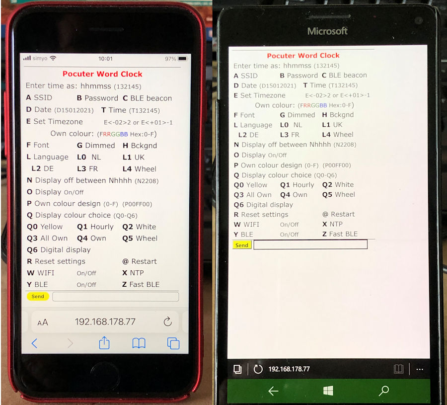
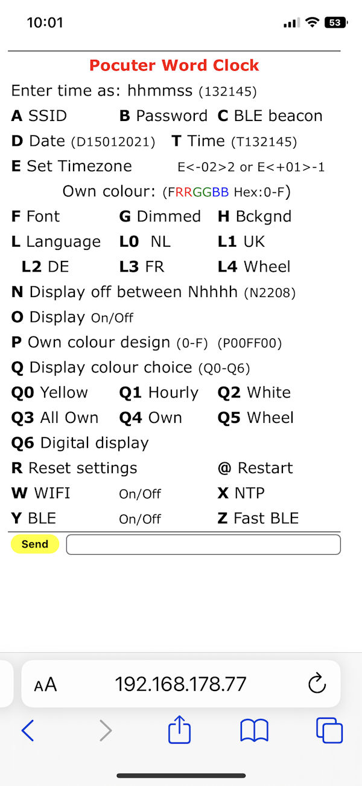
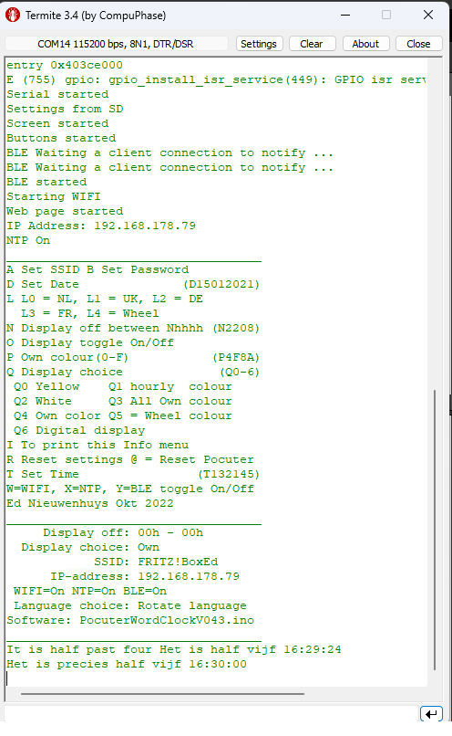
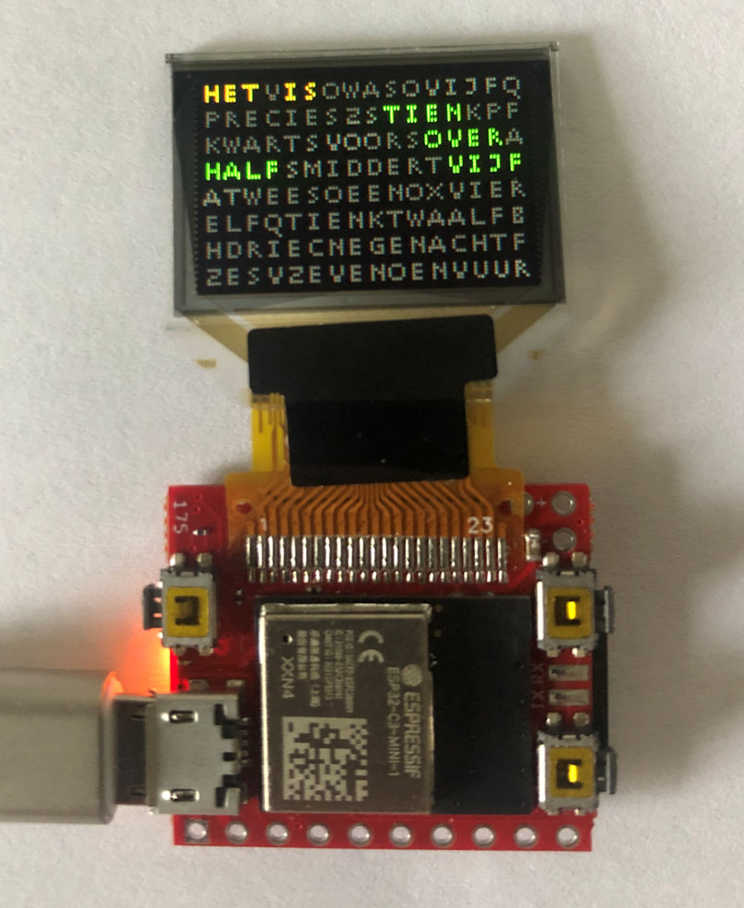
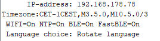

<h1>ESP32-C3 Pocuter word watch</h1>

A small watch that displays the time in words in Dutch, English, French and 
German or digital on a tiny display. The watch is able to receive time 
via NTP from the internet.  
Settings can be controlled via a webpage, PC and Bluetooth LE. If the watch is used stand-alone, without 
connections, it can be controlled with buttons.  

The watch is built in a Pocuter One equipped with&nbsp; a ESP32-C3 chip and 
SSD1131 OLED display built by <a href="https://www.pocuter.com/pocuter-one">
www.pocuter.com</a> 
The software is written in the Arduino IDE 1.8.19 and IDE 2.0.0. 
 
The software contains coding to use the: 
1 Pocuter One with 96x64 pixels OLED colour display 
2 BLE nRF UART connection with an option to send strings longer than 20 bytes 
3 Get time zone corrected time with daylight savings from a NTP server via WIFI 
4 RGB LED 
5 RTC for time keeping when off line 
6 Storage of the settings on SD-card. 
7 Or storage of the settings in the ESP32-C3 SPIFSS Flash memory 
8 Menu driven control of preferences with serial monitor, BLE and WIFI-html page 
9 Buttons 
10 Four languages to display time 
11 In V057 An analog clock display is added. 
11 In V059 Added OTA. 
 NB For Fast screen access an SD card must be inserted in the Pocuter. 
Therefore two versions are available. 
PocuterWordClockV0??FS.INO with fast screen; SD needed. 
PocuterWordClockV0??.INO with a slower screen but with no SD needed. 
<table>
	<tr>
		<td style="width: 248px">Het was tien over tien 10:13:00 
		Il est dix heures et quart 10:14:00 
		Il est dix heures et quart 10:15:00 
		Het is kwart over tien 10:16:00 
		Es war viertel nach zehn 10:17:00 
		It was quarter past ten 10:18:00 
		Il est dix heures vingt 10:19:00 
		Es ist zehn vor halb elf 10:20:00 
		Het is tien voor half elf 10:21:00 
		It was twenty past ten 10:22:00 
		It was twenty past ten 10:23:00 
		Het is vijf voor half elf 10:24:00 
		Es ist funf vor halb elf 10:25:00 
		It is twenty five past ten 10:26:00 
		Es war funf vor halb elf 10:27:00</td>
		<td></td>
	</tr>
	<tr>
		<td style="width: 248px">Display of the time in the serial output</td>
		<td>HTML page in iPhone 8 and Microsoft Phone</td>
	</tr>
</table>
 
<strong>First Use 
</strong>When the Pocuter is started and running properly the LED on the Pocuter will pulse red every second. 
 
When connected to WIFI&nbsp; the same led will also pulse green.&nbsp;  
Press the
the top right button to see the ip-address, time and date of the clock .
 
Date and ip-address will disappear as a new minute starts. 
Enter the ip-address in a browser or connect 
via Bluetooth and send the character 'I' to see for the menu. 
In the menu the name of the router to connect to, the SSID, and its password can 
be entered.  
 
 

<strong>Installations</strong>&nbsp;
 
There are two versions of this application.  
One version has the option to store preferences on a SD-card. The a fast screen 
access is also possible. 
In this mode the screen updates much faster. 
The other version has a slower screen access. No SD card is needed because the 
settings are stored in the SPIFFS memory of the ESP32-C3.  
There are to ino files and .bin version to upload available. The filename of the 
fast screen version end with FS.  
If you compile the application your self locate this line in the top of the program and remove the // for fast screen 
access and the use of an SD card. 
Compile and upload it into the pocuter 
 
//#define FASTSCREEN&nbsp;&nbsp;&nbsp;&nbsp; // Use SD for storage instead of SPIFFS. 
....

When a SD card is used: 
Insert a FAT formatted SD-card. Settings will be saved on it in both version. 
In 2022 the SD-card reader does not read all SD-cards properly. Use an old slow (eg 
80MB/s) 16GB or less card. 
If the SD-card is omitted the data will be stored in the Pocuter when the slow 
screen access version is used. With the FS-version data will be lost when the 
If the clock is connected to the internet it will seek contact with a time 
server.  
The time zone is set to UTC+1 Amsterdam but can be changed in the menu. 
To connect to a WIFI network a SSID and password must be entered. 
There are a few methods: 
- Connect the Pocuter with a serial cable to a PC and use a serial terminal. I 
use the Arduino IDE or <a href="https://www.compuphase.com/software_termite.htm">
Termite</a> as serial terminal. 
 
Sending the I for information will display the menu followed with the actual 
settings of several preferences

<table style="width: 51%">
	<tr>
		<td style="width: 342px">
		</td>
		<td style="width: 415px"></td>
	</tr>
	<tr>
		<td style="width: 342px">HTML page on iPhone </td>
		<td style="width: 415px"> 
Termite Terminal from a PC</td>
	</tr>
</table>
 

<table style="width: 919px">
	<tr>
		<td style="width: 550px">
		
- USE the BLE nRF connection with an UART serial terminal app 
to control it with your mobile phone or tablet. 
Use the IOS app:&nbsp;
<a href="https://apps.apple.com/nl/app/ble-serial-pro/id1632245655?l=en">BLE 
Serial Pro</a>. Turn on Fast BLE with option Z 
		 
For Android use:
<a href="https://play.google.com/store/apps/details?id=de.kai_morich.serial_bluetooth_terminal">
Serial Bluetooth terminal</a>. Turn off (default) Fast BLE.  Start the 
		app and find the Pocuter in the list of devices and connect to it. You 
		can change it's beacon name in the menu with option C. 
		 
		In both cases 
<strong>send the letter I 
of Information and the menu shows up</strong>. Enter the first letter of the setting you want to changes followed with a code. Some entries just toggle On and Off. Like the W to set WIFI Off or On. 

To change the SSID and password: <strong>A</strong><strong>my-ssid</strong> 
and send this command. Eg AFRITZ!Box01 or aFRITZ!Box01. Starting with an upper 
or lower case character is an identical instruction in the command string Then&nbsp; <strong>B</strong><strong>my password</strong> and send that password. 
<strong>Cbroadcastname</strong>&nbsp; will change to name displayed in the Bluetooth 
connection list.&nbsp;  If the length of the SSID and/or password is less then 5 characters the WIFI 
will be turned off automatically. This will speed up startup time if no internet connection is available Use a length of minimal 8 characters for SSID and password. Check in the menu (third row from the bottom) if WIFI and NTP are on. 
If WIFI is connected the LED on the Pocuter will pulse green. 
 Enter @ to reset the Pocuter. It will restart and connections will be made. 
 
To set a time zone. Send the the time zone string between the quotes prefixed with 
the character E or e. 
See the time zones at the bottom of this page. 
For example; if you live in Australia/Sydney send the string, eAEST-10AEDT,M10.1.0,M4.1.0/3

		</td>
		<td valign="bottom">
		
&nbsp;

<pre>A SSID B Password C BLE beacon name
D Set Date (D15012021)
E Set Timezone E&lt;-02&gt;2 or E&lt;+01&gt;-1
Make own colour of: (Hex RRGGBB)
F Font G Dimmed font H Bkgnd
I To print this Info menu
L L0 = NL, L1 = UK, L2 = DE
L3 = FR, L4 = Wheel
N Display off between Nhhhh (N2208)
O Display toggle On/Off
Q Display colour choice (Q0-6)
Q0 Yellow Q1 hourly
Q2 White Q3 All Own
Q4 Own Q5 Wheel
Q6 Digital display
R Reset settings @ = Reset Pocuter
T Set Time (T132145)
W=WIFI, X=NTP, Y=BLE, Z=Fast BLE
Ed Nieuwenhuys Okt 2022
___________________________________
Display off: 00h - 00h
Display choice: Wheel
SSID: FRITZ!BoxEd
BLE name: PocClockBlack
IP-address: 192.168.178.77
Timezone:CET-1CEST,M3.5.0,M10.5.0/3
WIFI=On NTP=On BLE=On Fast BLE=Off
Language choice: Rotate language
Software: PocuterWordClockV050.ino
___________________________________</pre>
		</td>
	</tr>
	<tr>
		<td style="width: 550px">&nbsp;</td>
		<td>Menu shown in serial output.</td>
	</tr>
</table>

 

<strong>Control and settings of the clock</strong>

If there is no WIFI connection time and digital or word clock mode can be set with 
the three buttons.  
Check at the bottom of the menu if WIFI is OFF.  
The clock will start much quicker because it 
will not try to connect. 

 Top 
Left: + 1 hour 
Right bottom: + 1 minute Top Right: Toggle between word or digital display 

As mentioned before the clock can be controlled with the WIFI webpage or BLE 
UART terminal app. 
When the clock is connected to WIFI the ip-address is displayed in the Digital display (Press 
Top right button to select it). 
Enter this ip-address numbers and dots (for example: 192.168.178.77) in the browser of your mobile or PC where you type 
your internet addresses (URL). 
or search items. 
Or 
Open the BLE terminal app. Look for the WordClock to connect to and connect. 
BLE connection can be made with my app
<a href="https://ednieuw.home.xs4all.nl/BLESerial/BLESerialPRO.html">BLE Serial 
pro</a> on the
<a href="https://apps.apple.com/nl/app/ble-serial-pro/id1632245655?l=en">app 
store</a> for Apple IOS devices.  
For Android
<a href="https://play.google.com/store/apps/details?id=com.nordicsemi.nrfUARTv2&amp;hl=en&amp;gl=US"> 
&nbsp;nRF UART terminal program </a>and
<a href="https://play.google.com/store/apps/details?id=de.kai_morich.serial_bluetooth_terminal">
Serial Bluetooth terminal from Kai Morich</a> Unfortunately this Android apps 
can not read strings longer than 20 characters. 
If you see a garbled menu enter and send the character 'Z' to select the slower 
transmission mode 
 
<strong>Settings are set by entering the first character of a command following by 
parameters if necessary.</strong> For example: To set the colours of the fonts in the display 
to white enter: Q2 To shown random all four languages every minute send L4. 
 
Set the time by entering T130245. (130245 will also work) 
 
Turn off WIFI by sending a W.

Reset the Pocuter with the letter @.

Reset to default setting by send R. 
 In the BLE connection the SSID and password will be shown.  
 
 
<table cellspacing="6" class="auto-style2" style="width: auto">
	<tr>
		<td style="width: 318px">
</td>
		<td>
		</td>
	</tr>
	<tr>
		<td style="width: 318px">HTML page</td>
		<td>BLE menu</td>
	</tr>
</table>

<strong>Detailed description</strong> 
 
With the menu many preferences can be set. These preferences are stored on a 
SD-card or in the ESP32-C3 storage space. 
&nbsp; 
Enter the first character in the menu of the item to be changed followed with the parameter. 
There is no difference between upper or lower case. Both are OK. 
Between the ( ) 
 
<strong>A SSID B Password C BLE beacon name</strong> 
Change the name of the SSID of the router to be connected to.  
aFRITZ!BoxEd or AFRITZ!BoxEd 
Then enter the password. For example: BSecret_pass 
Restart the Pocuter by sending @  
Entering a single 'b' will show the used password. This Easter egg can can used 
to check if a valid password was entered 
 
<strong>D Set Date</strong>&nbsp; and <strong>T Set Time</strong>  
If you are not connected to WIFI you have to set the time and date by hand 
For example enter: D06112022 to set the date to 6 November 2022.

Enter for example T132145 (or 132145 , or t132145)&nbsp; to set the time to 45 seconds and 21 minute past 
one o'clock.

<strong>E Set Timezone E&lt;-02&gt;2 or E&lt;+01&gt;-1</strong> 
At the bottom of this page you can find the time zones used in 2022.  
It is a rather complicated string and it is therefore wise to copy it. 
Let's pick one if you happen to live here: Antarctica/Troll,"&lt;+00&gt;0&lt;+02&gt;-2,M3.5.0/1,M10.5.0/3" 
Copy the string between the " "'s and send it with starting with an 'E' or 'e' in front. 
E&lt;+00&gt;0&lt;+02&gt;-2,M3.5.0/1,M10.5.0/3

<em>Time zones and daylight savings should be ended and replaced by one universal 
date and time for the while planet cq universe.  
But that is my opinion.</em>

<strong>Make own colour of: (Hex RRGGBB) 
F Font G Dimmed font H Bkgnd</strong> 
You can set the colours of the highlighted and dimmed characters and&nbsp; the back ground 
The time is shown with the colour defined with Font when Display choice Q3 or Q4 
is chosen and the rest of the not highlighted characters are coloured with the setting in Dimmed 
font. 
The format to be entered is hexadecimal. 0123456789ABCDEF are the character that 
can be used. 
The command is 2 digits for Red followed with&nbsp; two for Green and ending 
with two digits for Blue.  
To colour the characters intense red enter FF0000 prefixed with the letter F, G 
or H. 
To set the background to intense blue enter: H0000FF 
To set the dimmed character to dark gray enter for example: G191919. You get 
gray if red, green and blue has the same intensity.

<strong>I To print this Info menu</strong> 
Print the menu to Bluetooth and the serial monitor connected with an USB-cable 
 
<strong>L L0 = NL, L1 = UK, L2 = DE, L3 = FR, L4 = Wheel</strong> 
You can choose between four languages to display or show them randomly every 
minute. 
 
<strong>N Display off between Nhhhh (N2208)</strong> 
With N2208 the display will be turned off between 22:00 and 8:00. 
 
<strong>O Display toggle On/Off</strong> 
O toggle the display off and on.

 
<strong>P System LED toggle On/Off</strong> 
P Turn the RGB LED on the display off or on.

 
<strong>Q Display colour choice (Q0-6) 
Q0 Yellow Q1 hourly
Q2 White Q3 All Own
Q4 Own Q5 Wheel
Q6 Digital display</strong> 
 
Q0 will show the time with yellow words. 
Q1 will show every hour another colour. 
Q2 shows all the texts white. 
Q3 and Q4 uses you own defined colours. 
Q5 will follow rainbow colours every minute. 
Q6 is the digital display with the IP-address and date until seconds are 00. 
You can also press the top right button. 
The selected choice is displayed at the bottom of the menu. 
Send an 'I' to display the latest's settings

<strong>R Reset settings </strong> 
R will set all preferences to default settings, it also clears the SSID and password. 

<strong>@ = Restart Pocuter 
</strong>@ will restart the Pocuter. This is handy when the SSID, et cetera are 
changed and the program must be restarted.

<strong>W=WIFI, X=NTP, Y=BLE, Z=Use SD</strong> 
Toggle WIFI, NTP on and off. 
Enter the character will toggle it on or off. A the bottom of the menu the 
stated is printed. 
 

<strong>Z Fast BLE</strong> 
The
BLE UART protocol sends default packets of 20 bytes. Between every packet there is a delay of 50 
msec 
The IOS BLEserial app, and maybe others too, is able to receive packets of 80 
bytes or more before characters are missed and  
Option Z toggles between the long and short packages.&nbsp; 

Because not all 
Pocuter functionalities in the Pocuter library were described or could be found 
by me at the moment of writing this program several standard ESP32-C3 DEV 
functionality was used. In this software version only the Pocuter Button and 
OLED screen functionality were used 
 Settings are stored on the SD-card or if no SD is 
present in the SPIFFS space from the ESP32-C3  The following libraries are 
used.

<pre>#include &lt;Pocuter.h&gt;
#include &lt;NimBLEDevice.h&gt;      // For BLE communication  https://github.com/h2zero/NimBLE-Arduino
#include &lt;ESPNtpClient.h&gt;      // https://github.com/gmag11/ESPNtpClient
#include &lt;WiFi.h&gt;              // Used for NTP tme and web page
#include &lt;AsyncTCP.h&gt;          // Used for webpage   https://github.com/me-no-dev/ESPAsyncWebServer
#include &lt;ESPAsyncWebServer.h&gt; // Used for webpage   <a href="https://github.com/me-no-dev/ESPAsyncWebServer">https://github.com/me-no-dev/ESPAsyncWebServer</a>
#include &lt;Preferences.h&gt;       // Used for SPIFFS file system</pre>

To compile the software some standard setting must be changed.  First copy 
the Pocuter libraries in the libraries folder where your sketches are saved.  In my 
case copy from here: c:\Program Files (x86)\Arduino\libraries\Pocuter\ to here 
<a href="../libraries/Pocuter/">c:\Users\ednie\Documents\Files\Arduino\libraries\Pocuter\</a> 
Now we do not change the original Pocuter library and we keep all the 
non-standard Arduino libraries in one place.

To be able to compile the ESP32 Arduino boards must be installed and the 
ESP32 C3 DEV board selected. 
Maybe the latest Pocuter board also compiles fine and you can use Fast screen 
mode with SPIFFS storage. 

&nbsp;

 

One change must be made in the file: 
"C:\Users\ednie\Documents\Files\Arduino\libraries\Pocuter\include\PocuterLibConfig.h" 
Because we do not use the Pocuter WIFI library we have to disable the WIFI to 
avoid a compilation error of the ESP32 WIFI library. So remove the // before 
#define POCUTER_DISABLE_WIFI to disable the Pocuter WIFI lbrary.<pre>
/* Dont use WIFI functions */
 #define POCUTER_DISABLE_WIFI</pre>
When compiling the program these are the last lines for Version V052:<pre>Successfully created esp32c3 image.
"C:\\Users\\ednie\\AppData\\Local\\Arduino15\\packages\\esp32\\hardware\\esp32\\2.0.5/tools/gen_esp32part.exe" -q "C:\\Users\\ednie\\AppData\\Local\\Temp\\arduino_build_992263/partitions.csv" "C:\\Users\\ednie\\AppData\\Local\\Temp\\arduino_build_992263/PocuterWordClockV052.ino.partitions.bin"
Multiple libraries were found for "WiFi.h"
Used: C:\Users\ednie\AppData\Local\Arduino15\packages\esp32\hardware\esp32\2.0.5\libraries\WiFi
Not used: C:\Users\ednie\Documents\Files\Arduino\libraries\WiFiNINA
Not used: C:\Program Files (x86)\Arduino\libraries\WiFi
Multiple libraries were found for "Pocuter.h"
Used: C:\Users\ednie\Documents\Files\Arduino\libraries\Pocuter
Not used: C:\Program Files (x86)\Arduino\libraries\Pocuter
Using library Pocuter in folder: C:\Users\ednie\Documents\Files\Arduino\libraries\Pocuter (legacy)
Using library NimBLE-Arduino at version 1.4.1 in folder: C:\Users\ednie\Documents\Files\Arduino\libraries\NimBLE-Arduino 
Using library ESPNTP in folder: C:\Users\ednie\Documents\Files\Arduino\libraries\ESPNTP (legacy)
Using library WiFi at version 2.0.0 in folder: C:\Users\ednie\AppData\Local\Arduino15\packages\esp32\hardware\esp32\2.0.5\libraries\WiFi 
Using library Ticker at version 2.0.0 in folder: C:\Users\ednie\AppData\Local\Arduino15\packages\esp32\hardware\esp32\2.0.5\libraries\Ticker 
Using library AsyncTCP-master at version 1.1.1 in folder: C:\Users\ednie\Documents\Files\Arduino\libraries\AsyncTCP-master 
Using library ESPAsyncWebServer-master at version 1.2.3 in folder: C:\Users\ednie\Documents\Files\Arduino\libraries\ESPAsyncWebServer-master 
Using library FS at version 2.0.0 in folder: C:\Users\ednie\AppData\Local\Arduino15\packages\esp32\hardware\esp32\2.0.5\libraries\FS 
Using library Preferences at version 2.0.0 in folder: C:\Users\ednie\AppData\Local\Arduino15\packages\esp32\hardware\esp32\2.0.5\libraries\Preferences 
"C:\\Users\\ednie\\AppData\\Local\\Arduino15\\packages\\esp32\\tools\\riscv32-esp-elf-gcc\\gcc8_4_0-esp-2021r2-patch3/bin/riscv32-esp-elf-size" -A "C:\\Users\\ednie\\AppData\\Local\\Temp\\arduino_build_992263/PocuterWordClockV052.ino.elf"
Sketch uses 1265096 bytes (40%) of program storage space. Maximum is 3145728 bytes.
Global variables use 44044 bytes (13%) of dynamic memory, leaving 283636 bytes for local variables. Maximum is 327680 bytes. 
</pre>

&nbsp;

<strong>Some lessons learned:</strong>

<ul>
	<li>Use&nbsp;pocuter-&gt;begin(PocuterDisplay::BUFFER_MODE_DOUBLE_BUFFER);&nbsp; 
	for a fast screen display</li>
	<li>To print to the Serial monitor and receive input from it 
	Use USBSerial instead of Serial.&nbsp; <strong>Serial.print is USBSerial.print</strong></li>
	<li>Saving of a file in ESP32 memory with EEPROM, Preferences 
	libraries in the Pocuter ESP32 memory does not work in combination with the 
	fast display mode. 
	( pocuter-&gt;begin(PocuterDisplay::BUFFER_MODE_DOUBLE_BUFFER);&nbsp; ) 
	Use: pocuter-&gt;begin();  
	</li>
</ul>

<strong>If the Pocuter hangs or rests constantly uploads are not possible 
anymore you can place the pocuter in upload mode 
Press the button near the pins, keep it down, press and release the reset button 
near the USB-port and release the button near the pins.</strong> 
It is a little fiddling with the small buttons but it worked for me always to 
upload again after dozens of crashes due to bugs and programming errors

&nbsp;

Ed Nieuwenhuys, November 2022&nbsp;

https://ednieuw.home.xs4all.nl/Woordklok/index.html

&nbsp;

<strong>Timezones</strong>.  
Copy the text between the quotes and paste them after the character E 

<pre>Africa/Abidjan,"GMT0"
Africa/Accra,"GMT0"
Africa/Addis_Ababa,"EAT-3"
Africa/Algiers,"CET-1"
Africa/Asmara,"EAT-3"
Africa/Bamako,"GMT0"
Africa/Bangui,"WAT-1"
Africa/Banjul,"GMT0"
Africa/Bissau,"GMT0"
Africa/Blantyre,"CAT-2"
Africa/Brazzaville,"WAT-1"
Africa/Bujumbura,"CAT-2"
Africa/Cairo,"EET-2"
Africa/Casablanca,"&lt;+01&gt;-1"
Africa/Ceuta,"CET-1CEST,M3.5.0,M10.5.0/3"
Africa/Conakry,"GMT0"
Africa/Dakar,"GMT0"
Africa/Dar_es_Salaam,"EAT-3"
Africa/Djibouti,"EAT-3"
Africa/Douala,"WAT-1"
Africa/El_Aaiun,"&lt;+01&gt;-1"
Africa/Freetown,"GMT0"
Africa/Gaborone,"CAT-2"
Africa/Harare,"CAT-2"
Africa/Johannesburg,"SAST-2"
Africa/Juba,"CAT-2"
Africa/Kampala,"EAT-3"
Africa/Khartoum,"CAT-2"
Africa/Kigali,"CAT-2"
Africa/Kinshasa,"WAT-1"
Africa/Lagos,"WAT-1"
Africa/Libreville,"WAT-1"
Africa/Lome,"GMT0"
Africa/Luanda,"WAT-1"
Africa/Lubumbashi,"CAT-2"
Africa/Lusaka,"CAT-2"
Africa/Malabo,"WAT-1"
Africa/Maputo,"CAT-2"
Africa/Maseru,"SAST-2"
Africa/Mbabane,"SAST-2"
Africa/Mogadishu,"EAT-3"
Africa/Monrovia,"GMT0"
Africa/Nairobi,"EAT-3"
Africa/Ndjamena,"WAT-1"
Africa/Niamey,"WAT-1"
Africa/Nouakchott,"GMT0"
Africa/Ouagadougou,"GMT0"
Africa/Porto-Novo,"WAT-1"
Africa/Sao_Tome,"GMT0"
Africa/Tripoli,"EET-2"
Africa/Tunis,"CET-1"
Africa/Windhoek,"CAT-2"
America/Adak,"HST10HDT,M3.2.0,M11.1.0"
America/Anchorage,"AKST9AKDT,M3.2.0,M11.1.0"
America/Anguilla,"AST4"
America/Antigua,"AST4"
America/Araguaina,"&lt;-03&gt;3"
America/Argentina/Buenos_Aires,"&lt;-03&gt;3"
America/Argentina/Catamarca,"&lt;-03&gt;3"
America/Argentina/Cordoba,"&lt;-03&gt;3"
America/Argentina/Jujuy,"&lt;-03&gt;3"
America/Argentina/La_Rioja,"&lt;-03&gt;3"
America/Argentina/Mendoza,"&lt;-03&gt;3"
America/Argentina/Rio_Gallegos,"&lt;-03&gt;3"
America/Argentina/Salta,"&lt;-03&gt;3"
America/Argentina/San_Juan,"&lt;-03&gt;3"
America/Argentina/San_Luis,"&lt;-03&gt;3"
America/Argentina/Tucuman,"&lt;-03&gt;3"
America/Argentina/Ushuaia,"&lt;-03&gt;3"
America/Aruba,"AST4"
America/Asuncion,"&lt;-04&gt;4&lt;-03&gt;,M10.1.0/0,M3.4.0/0"
America/Atikokan,"EST5"
America/Bahia,"&lt;-03&gt;3"
America/Bahia_Banderas,"CST6CDT,M4.1.0,M10.5.0"
America/Barbados,"AST4"
America/Belem,"&lt;-03&gt;3"
America/Belize,"CST6"
America/Blanc-Sablon,"AST4"
America/Boa_Vista,"&lt;-04&gt;4"
America/Bogota,"&lt;-05&gt;5"
America/Boise,"MST7MDT,M3.2.0,M11.1.0"
America/Cambridge_Bay,"MST7MDT,M3.2.0,M11.1.0"
America/Campo_Grande,"&lt;-04&gt;4"
America/Cancun,"EST5"
America/Caracas,"&lt;-04&gt;4"
America/Cayenne,"&lt;-03&gt;3"
America/Cayman,"EST5"
America/Chicago,"CST6CDT,M3.2.0,M11.1.0"
America/Chihuahua,"MST7MDT,M4.1.0,M10.5.0"
America/Costa_Rica,"CST6"
America/Creston,"MST7"
America/Cuiaba,"&lt;-04&gt;4"
America/Curacao,"AST4"
America/Danmarkshavn,"GMT0"
America/Dawson,"MST7"
America/Dawson_Creek,"MST7"
America/Denver,"MST7MDT,M3.2.0,M11.1.0"
America/Detroit,"EST5EDT,M3.2.0,M11.1.0"
America/Dominica,"AST4"
America/Edmonton,"MST7MDT,M3.2.0,M11.1.0"
America/Eirunepe,"&lt;-05&gt;5"
America/El_Salvador,"CST6"
America/Fortaleza,"&lt;-03&gt;3"
America/Fort_Nelson,"MST7"
America/Glace_Bay,"AST4ADT,M3.2.0,M11.1.0"
America/Godthab,"&lt;-03&gt;3&lt;-02&gt;,M3.5.0/-2,M10.5.0/-1"
America/Goose_Bay,"AST4ADT,M3.2.0,M11.1.0"
America/Grand_Turk,"EST5EDT,M3.2.0,M11.1.0"
America/Grenada,"AST4"
America/Guadeloupe,"AST4"
America/Guatemala,"CST6"
America/Guayaquil,"&lt;-05&gt;5"
America/Guyana,"&lt;-04&gt;4"
America/Halifax,"AST4ADT,M3.2.0,M11.1.0"
America/Havana,"CST5CDT,M3.2.0/0,M11.1.0/1"
America/Hermosillo,"MST7"
America/Indiana/Indianapolis,"EST5EDT,M3.2.0,M11.1.0"
America/Indiana/Knox,"CST6CDT,M3.2.0,M11.1.0"
America/Indiana/Marengo,"EST5EDT,M3.2.0,M11.1.0"
America/Indiana/Petersburg,"EST5EDT,M3.2.0,M11.1.0"
America/Indiana/Tell_City,"CST6CDT,M3.2.0,M11.1.0"
America/Indiana/Vevay,"EST5EDT,M3.2.0,M11.1.0"
America/Indiana/Vincennes,"EST5EDT,M3.2.0,M11.1.0"
America/Indiana/Winamac,"EST5EDT,M3.2.0,M11.1.0"
America/Inuvik,"MST7MDT,M3.2.0,M11.1.0"
America/Iqaluit,"EST5EDT,M3.2.0,M11.1.0"
America/Jamaica,"EST5"
America/Juneau,"AKST9AKDT,M3.2.0,M11.1.0"
America/Kentucky/Louisville,"EST5EDT,M3.2.0,M11.1.0"
America/Kentucky/Monticello,"EST5EDT,M3.2.0,M11.1.0"
America/Kralendijk,"AST4"
America/La_Paz,"&lt;-04&gt;4"
America/Lima,"&lt;-05&gt;5"
America/Los_Angeles,"PST8PDT,M3.2.0,M11.1.0"
America/Lower_Princes,"AST4"
America/Maceio,"&lt;-03&gt;3"
America/Managua,"CST6"
America/Manaus,"&lt;-04&gt;4"
America/Marigot,"AST4"
America/Martinique,"AST4"
America/Matamoros,"CST6CDT,M3.2.0,M11.1.0"
America/Mazatlan,"MST7MDT,M4.1.0,M10.5.0"
America/Menominee,"CST6CDT,M3.2.0,M11.1.0"
America/Merida,"CST6CDT,M4.1.0,M10.5.0"
America/Metlakatla,"AKST9AKDT,M3.2.0,M11.1.0"
America/Mexico_City,"CST6CDT,M4.1.0,M10.5.0"
America/Miquelon,"&lt;-03&gt;3&lt;-02&gt;,M3.2.0,M11.1.0"
America/Moncton,"AST4ADT,M3.2.0,M11.1.0"
America/Monterrey,"CST6CDT,M4.1.0,M10.5.0"
America/Montevideo,"&lt;-03&gt;3"
America/Montreal,"EST5EDT,M3.2.0,M11.1.0"
America/Montserrat,"AST4"
America/Nassau,"EST5EDT,M3.2.0,M11.1.0"
America/New_York,"EST5EDT,M3.2.0,M11.1.0"
America/Nipigon,"EST5EDT,M3.2.0,M11.1.0"
America/Nome,"AKST9AKDT,M3.2.0,M11.1.0"
America/Noronha,"&lt;-02&gt;2"
America/North_Dakota/Beulah,"CST6CDT,M3.2.0,M11.1.0"
America/North_Dakota/Center,"CST6CDT,M3.2.0,M11.1.0"
America/North_Dakota/New_Salem,"CST6CDT,M3.2.0,M11.1.0"
America/Nuuk,"&lt;-03&gt;3&lt;-02&gt;,M3.5.0/-2,M10.5.0/-1"
America/Ojinaga,"MST7MDT,M3.2.0,M11.1.0"
America/Panama,"EST5"
America/Pangnirtung,"EST5EDT,M3.2.0,M11.1.0"
America/Paramaribo,"&lt;-03&gt;3"
America/Phoenix,"MST7"
America/Port-au-Prince,"EST5EDT,M3.2.0,M11.1.0"
America/Port_of_Spain,"AST4"
America/Porto_Velho,"&lt;-04&gt;4"
America/Puerto_Rico,"AST4"
America/Punta_Arenas,"&lt;-03&gt;3"
America/Rainy_River,"CST6CDT,M3.2.0,M11.1.0"
America/Rankin_Inlet,"CST6CDT,M3.2.0,M11.1.0"
America/Recife,"&lt;-03&gt;3"
America/Regina,"CST6"
America/Resolute,"CST6CDT,M3.2.0,M11.1.0"
America/Rio_Branco,"&lt;-05&gt;5"
America/Santarem,"&lt;-03&gt;3"
America/Santiago,"&lt;-04&gt;4&lt;-03&gt;,M9.1.6/24,M4.1.6/24"
America/Santo_Domingo,"AST4"
America/Sao_Paulo,"&lt;-03&gt;3"
America/Scoresbysund,"&lt;-01&gt;1&lt;+00&gt;,M3.5.0/0,M10.5.0/1"
America/Sitka,"AKST9AKDT,M3.2.0,M11.1.0"
America/St_Barthelemy,"AST4"
America/St_Johns,"NST3:30NDT,M3.2.0,M11.1.0"
America/St_Kitts,"AST4"
America/St_Lucia,"AST4"
America/St_Thomas,"AST4"
America/St_Vincent,"AST4"
America/Swift_Current,"CST6"
America/Tegucigalpa,"CST6"
America/Thule,"AST4ADT,M3.2.0,M11.1.0"
America/Thunder_Bay,"EST5EDT,M3.2.0,M11.1.0"
America/Tijuana,"PST8PDT,M3.2.0,M11.1.0"
America/Toronto,"EST5EDT,M3.2.0,M11.1.0"
America/Tortola,"AST4"
America/Vancouver,"PST8PDT,M3.2.0,M11.1.0"
America/Whitehorse,"MST7"
America/Winnipeg,"CST6CDT,M3.2.0,M11.1.0"
America/Yakutat,"AKST9AKDT,M3.2.0,M11.1.0"
America/Yellowknife,"MST7MDT,M3.2.0,M11.1.0"
Antarctica/Casey,"&lt;+11&gt;-11"
Antarctica/Davis,"&lt;+07&gt;-7"
Antarctica/DumontDUrville,"&lt;+10&gt;-10"
Antarctica/Macquarie,"AEST-10AEDT,M10.1.0,M4.1.0/3"
Antarctica/Mawson,"&lt;+05&gt;-5"
Antarctica/McMurdo,"NZST-12NZDT,M9.5.0,M4.1.0/3"
Antarctica/Palmer,"&lt;-03&gt;3"
Antarctica/Rothera,"&lt;-03&gt;3"
Antarctica/Syowa,"&lt;+03&gt;-3"
Antarctica/Troll,"&lt;+00&gt;0&lt;+02&gt;-2,M3.5.0/1,M10.5.0/3"
Antarctica/Vostok,"&lt;+06&gt;-6"
Arctic/Longyearbyen,"CET-1CEST,M3.5.0,M10.5.0/3"
Asia/Aden,"&lt;+03&gt;-3"
Asia/Almaty,"&lt;+06&gt;-6"
Asia/Amman,"EET-2EEST,M2.5.4/24,M10.5.5/1"
Asia/Anadyr,"&lt;+12&gt;-12"
Asia/Aqtau,"&lt;+05&gt;-5"
Asia/Aqtobe,"&lt;+05&gt;-5"
Asia/Ashgabat,"&lt;+05&gt;-5"
Asia/Atyrau,"&lt;+05&gt;-5"
Asia/Baghdad,"&lt;+03&gt;-3"
Asia/Bahrain,"&lt;+03&gt;-3"
Asia/Baku,"&lt;+04&gt;-4"
Asia/Bangkok,"&lt;+07&gt;-7"
Asia/Barnaul,"&lt;+07&gt;-7"
Asia/Beirut,"EET-2EEST,M3.5.0/0,M10.5.0/0"
Asia/Bishkek,"&lt;+06&gt;-6"
Asia/Brunei,"&lt;+08&gt;-8"
Asia/Chita,"&lt;+09&gt;-9"
Asia/Choibalsan,"&lt;+08&gt;-8"
Asia/Colombo,"&lt;+0530&gt;-5:30"
Asia/Damascus,"EET-2EEST,M3.5.5/0,M10.5.5/0"
Asia/Dhaka,"&lt;+06&gt;-6"
Asia/Dili,"&lt;+09&gt;-9"
Asia/Dubai,"&lt;+04&gt;-4"
Asia/Dushanbe,"&lt;+05&gt;-5"
Asia/Famagusta,"EET-2EEST,M3.5.0/3,M10.5.0/4"
Asia/Gaza,"EET-2EEST,M3.4.4/48,M10.5.5/1"
Asia/Hebron,"EET-2EEST,M3.4.4/48,M10.5.5/1"
Asia/Ho_Chi_Minh,"&lt;+07&gt;-7"
Asia/Hong_Kong,"HKT-8"
Asia/Hovd,"&lt;+07&gt;-7"
Asia/Irkutsk,"&lt;+08&gt;-8"
Asia/Jakarta,"WIB-7"
Asia/Jayapura,"WIT-9"
Asia/Jerusalem,"IST-2IDT,M3.4.4/26,M10.5.0"
Asia/Kabul,"&lt;+0430&gt;-4:30"
Asia/Kamchatka,"&lt;+12&gt;-12"
Asia/Karachi,"PKT-5"
Asia/Kathmandu,"&lt;+0545&gt;-5:45"
Asia/Khandyga,"&lt;+09&gt;-9"
Asia/Kolkata,"IST-5:30"
Asia/Krasnoyarsk,"&lt;+07&gt;-7"
Asia/Kuala_Lumpur,"&lt;+08&gt;-8"
Asia/Kuching,"&lt;+08&gt;-8"
Asia/Kuwait,"&lt;+03&gt;-3"
Asia/Macau,"CST-8"
Asia/Magadan,"&lt;+11&gt;-11"
Asia/Makassar,"WITA-8"
Asia/Manila,"PST-8"
Asia/Muscat,"&lt;+04&gt;-4"
Asia/Nicosia,"EET-2EEST,M3.5.0/3,M10.5.0/4"
Asia/Novokuznetsk,"&lt;+07&gt;-7"
Asia/Novosibirsk,"&lt;+07&gt;-7"
Asia/Omsk,"&lt;+06&gt;-6"
Asia/Oral,"&lt;+05&gt;-5"
Asia/Phnom_Penh,"&lt;+07&gt;-7"
Asia/Pontianak,"WIB-7"
Asia/Pyongyang,"KST-9"
Asia/Qatar,"&lt;+03&gt;-3"
Asia/Qyzylorda,"&lt;+05&gt;-5"
Asia/Riyadh,"&lt;+03&gt;-3"
Asia/Sakhalin,"&lt;+11&gt;-11"
Asia/Samarkand,"&lt;+05&gt;-5"
Asia/Seoul,"KST-9"
Asia/Shanghai,"CST-8"
Asia/Singapore,"&lt;+08&gt;-8"
Asia/Srednekolymsk,"&lt;+11&gt;-11"
Asia/Taipei,"CST-8"
Asia/Tashkent,"&lt;+05&gt;-5"
Asia/Tbilisi,"&lt;+04&gt;-4"
Asia/Tehran,"&lt;+0330&gt;-3:30&lt;+0430&gt;,J79/24,J263/24"
Asia/Thimphu,"&lt;+06&gt;-6"
Asia/Tokyo,"JST-9"
Asia/Tomsk,"&lt;+07&gt;-7"
Asia/Ulaanbaatar,"&lt;+08&gt;-8"
Asia/Urumqi,"&lt;+06&gt;-6"
Asia/Ust-Nera,"&lt;+10&gt;-10"
Asia/Vientiane,"&lt;+07&gt;-7"
Asia/Vladivostok,"&lt;+10&gt;-10"
Asia/Yakutsk,"&lt;+09&gt;-9"
Asia/Yangon,"&lt;+0630&gt;-6:30"
Asia/Yekaterinburg,"&lt;+05&gt;-5"
Asia/Yerevan,"&lt;+04&gt;-4"
Atlantic/Azores,"&lt;-01&gt;1&lt;+00&gt;,M3.5.0/0,M10.5.0/1"
Atlantic/Bermuda,"AST4ADT,M3.2.0,M11.1.0"
Atlantic/Canary,"WET0WEST,M3.5.0/1,M10.5.0"
Atlantic/Cape_Verde,"&lt;-01&gt;1"
Atlantic/Faroe,"WET0WEST,M3.5.0/1,M10.5.0"
Atlantic/Madeira,"WET0WEST,M3.5.0/1,M10.5.0"
Atlantic/Reykjavik,"GMT0"
Atlantic/South_Georgia,"&lt;-02&gt;2"
Atlantic/Stanley,"&lt;-03&gt;3"
Atlantic/St_Helena,"GMT0"
Australia/Adelaide,"ACST-9:30ACDT,M10.1.0,M4.1.0/3"
Australia/Brisbane,"AEST-10"
Australia/Broken_Hill,"ACST-9:30ACDT,M10.1.0,M4.1.0/3"
Australia/Currie,"AEST-10AEDT,M10.1.0,M4.1.0/3"
Australia/Darwin,"ACST-9:30"
Australia/Eucla,"&lt;+0845&gt;-8:45"
Australia/Hobart,"AEST-10AEDT,M10.1.0,M4.1.0/3"
Australia/Lindeman,"AEST-10"
Australia/Lord_Howe,"&lt;+1030&gt;-10:30&lt;+11&gt;-11,M10.1.0,M4.1.0"
Australia/Melbourne,"AEST-10AEDT,M10.1.0,M4.1.0/3"
Australia/Perth,"AWST-8"
Australia/Sydney,"AEST-10AEDT,M10.1.0,M4.1.0/3"
Europe/Amsterdam,"CET-1CEST,M3.5.0,M10.5.0/3"
Europe/Andorra,"CET-1CEST,M3.5.0,M10.5.0/3"
Europe/Astrakhan,"&lt;+04&gt;-4"
Europe/Athens,"EET-2EEST,M3.5.0/3,M10.5.0/4"
Europe/Belgrade,"CET-1CEST,M3.5.0,M10.5.0/3"
Europe/Berlin,"CET-1CEST,M3.5.0,M10.5.0/3"
Europe/Bratislava,"CET-1CEST,M3.5.0,M10.5.0/3"
Europe/Brussels,"CET-1CEST,M3.5.0,M10.5.0/3"
Europe/Bucharest,"EET-2EEST,M3.5.0/3,M10.5.0/4"
Europe/Budapest,"CET-1CEST,M3.5.0,M10.5.0/3"
Europe/Busingen,"CET-1CEST,M3.5.0,M10.5.0/3"
Europe/Chisinau,"EET-2EEST,M3.5.0,M10.5.0/3"
Europe/Copenhagen,"CET-1CEST,M3.5.0,M10.5.0/3"
Europe/Dublin,"IST-1GMT0,M10.5.0,M3.5.0/1"
Europe/Gibraltar,"CET-1CEST,M3.5.0,M10.5.0/3"
Europe/Guernsey,"GMT0BST,M3.5.0/1,M10.5.0"
Europe/Helsinki,"EET-2EEST,M3.5.0/3,M10.5.0/4"
Europe/Isle_of_Man,"GMT0BST,M3.5.0/1,M10.5.0"
Europe/Istanbul,"&lt;+03&gt;-3"
Europe/Jersey,"GMT0BST,M3.5.0/1,M10.5.0"
Europe/Kaliningrad,"EET-2"
Europe/Kiev,"EET-2EEST,M3.5.0/3,M10.5.0/4"
Europe/Kirov,"&lt;+03&gt;-3"
Europe/Lisbon,"WET0WEST,M3.5.0/1,M10.5.0"
Europe/Ljubljana,"CET-1CEST,M3.5.0,M10.5.0/3"
Europe/London,"GMT0BST,M3.5.0/1,M10.5.0"
Europe/Luxembourg,"CET-1CEST,M3.5.0,M10.5.0/3"
Europe/Madrid,"CET-1CEST,M3.5.0,M10.5.0/3"
Europe/Malta,"CET-1CEST,M3.5.0,M10.5.0/3"
Europe/Mariehamn,"EET-2EEST,M3.5.0/3,M10.5.0/4"
Europe/Minsk,"&lt;+03&gt;-3"
Europe/Monaco,"CET-1CEST,M3.5.0,M10.5.0/3"
Europe/Moscow,"MSK-3"
Europe/Oslo,"CET-1CEST,M3.5.0,M10.5.0/3"
Europe/Paris,"CET-1CEST,M3.5.0,M10.5.0/3"
Europe/Podgorica,"CET-1CEST,M3.5.0,M10.5.0/3"
Europe/Prague,"CET-1CEST,M3.5.0,M10.5.0/3"
Europe/Riga,"EET-2EEST,M3.5.0/3,M10.5.0/4"
Europe/Rome,"CET-1CEST,M3.5.0,M10.5.0/3"
Europe/Samara,"&lt;+04&gt;-4"
Europe/San_Marino,"CET-1CEST,M3.5.0,M10.5.0/3"
Europe/Sarajevo,"CET-1CEST,M3.5.0,M10.5.0/3"
Europe/Saratov,"&lt;+04&gt;-4"
Europe/Simferopol,"MSK-3"
Europe/Skopje,"CET-1CEST,M3.5.0,M10.5.0/3"
Europe/Sofia,"EET-2EEST,M3.5.0/3,M10.5.0/4"
Europe/Stockholm,"CET-1CEST,M3.5.0,M10.5.0/3"
Europe/Tallinn,"EET-2EEST,M3.5.0/3,M10.5.0/4"
Europe/Tirane,"CET-1CEST,M3.5.0,M10.5.0/3"
Europe/Ulyanovsk,"&lt;+04&gt;-4"
Europe/Uzhgorod,"EET-2EEST,M3.5.0/3,M10.5.0/4"
Europe/Vaduz,"CET-1CEST,M3.5.0,M10.5.0/3"
Europe/Vatican,"CET-1CEST,M3.5.0,M10.5.0/3"
Europe/Vienna,"CET-1CEST,M3.5.0,M10.5.0/3"
Europe/Vilnius,"EET-2EEST,M3.5.0/3,M10.5.0/4"
Europe/Volgograd,"&lt;+03&gt;-3"
Europe/Warsaw,"CET-1CEST,M3.5.0,M10.5.0/3"
Europe/Zagreb,"CET-1CEST,M3.5.0,M10.5.0/3"
Europe/Zaporozhye,"EET-2EEST,M3.5.0/3,M10.5.0/4"
Europe/Zurich,"CET-1CEST,M3.5.0,M10.5.0/3"
Indian/Antananarivo,"EAT-3"
Indian/Chagos,"&lt;+06&gt;-6"
Indian/Christmas,"&lt;+07&gt;-7"
Indian/Cocos,"&lt;+0630&gt;-6:30"
Indian/Comoro,"EAT-3"
Indian/Kerguelen,"&lt;+05&gt;-5"
Indian/Mahe,"&lt;+04&gt;-4"
Indian/Maldives,"&lt;+05&gt;-5"
Indian/Mauritius,"&lt;+04&gt;-4"
Indian/Mayotte,"EAT-3"
Indian/Reunion,"&lt;+04&gt;-4"
Pacific/Apia,"&lt;+13&gt;-13"
Pacific/Auckland,"NZST-12NZDT,M9.5.0,M4.1.0/3"
Pacific/Bougainville,"&lt;+11&gt;-11"
Pacific/Chatham,"&lt;+1245&gt;-12:45&lt;+1345&gt;,M9.5.0/2:45,M4.1.0/3:45"
Pacific/Chuuk,"&lt;+10&gt;-10"
Pacific/Easter,"&lt;-06&gt;6&lt;-05&gt;,M9.1.6/22,M4.1.6/22"
Pacific/Efate,"&lt;+11&gt;-11"
Pacific/Enderbury,"&lt;+13&gt;-13"
Pacific/Fakaofo,"&lt;+13&gt;-13"
Pacific/Fiji,"&lt;+12&gt;-12&lt;+13&gt;,M11.2.0,M1.2.3/99"
Pacific/Funafuti,"&lt;+12&gt;-12"
Pacific/Galapagos,"&lt;-06&gt;6"
Pacific/Gambier,"&lt;-09&gt;9"
Pacific/Guadalcanal,"&lt;+11&gt;-11"
Pacific/Guam,"ChST-10"
Pacific/Honolulu,"HST10"
Pacific/Kiritimati,"&lt;+14&gt;-14"
Pacific/Kosrae,"&lt;+11&gt;-11"
Pacific/Kwajalein,"&lt;+12&gt;-12"
Pacific/Majuro,"&lt;+12&gt;-12"
Pacific/Marquesas,"&lt;-0930&gt;9:30"
Pacific/Midway,"SST11"
Pacific/Nauru,"&lt;+12&gt;-12"
Pacific/Niue,"&lt;-11&gt;11"
Pacific/Norfolk,"&lt;+11&gt;-11&lt;+12&gt;,M10.1.0,M4.1.0/3"
Pacific/Noumea,"&lt;+11&gt;-11"
Pacific/Pago_Pago,"SST11"
Pacific/Palau,"&lt;+09&gt;-9"
Pacific/Pitcairn,"&lt;-08&gt;8"
Pacific/Pohnpei,"&lt;+11&gt;-11"
Pacific/Port_Moresby,"&lt;+10&gt;-10"
Pacific/Rarotonga,"&lt;-10&gt;10"
Pacific/Saipan,"ChST-10"
Pacific/Tahiti,"&lt;-10&gt;10"
Pacific/Tarawa,"&lt;+12&gt;-12"
Pacific/Tongatapu,"&lt;+13&gt;-13"
Pacific/Wake,"&lt;+12&gt;-12"
Pacific/Wallis,"&lt;+12&gt;-12"
Etc/GMT,"GMT0"
Etc/GMT-0,"GMT0"
Etc/GMT-1,"&lt;+01&gt;-1"
Etc/GMT-2,"&lt;+02&gt;-2"
Etc/GMT-3,"&lt;+03&gt;-3"
Etc/GMT-4,"&lt;+04&gt;-4"
Etc/GMT-5,"&lt;+05&gt;-5"
Etc/GMT-6,"&lt;+06&gt;-6"
Etc/GMT-7,"&lt;+07&gt;-7"
Etc/GMT-8,"&lt;+08&gt;-8"
Etc/GMT-9,"&lt;+09&gt;-9"
Etc/GMT-10,"&lt;+10&gt;-10"
Etc/GMT-11,"&lt;+11&gt;-11"
Etc/GMT-12,"&lt;+12&gt;-12"
Etc/GMT-13,"&lt;+13&gt;-13"
Etc/GMT-14,"&lt;+14&gt;-14"
Etc/GMT0,"GMT0"
Etc/GMT+0,"GMT0"
Etc/GMT+1,"&lt;-01&gt;1"
Etc/GMT+2,"&lt;-02&gt;2"
Etc/GMT+3,"&lt;-03&gt;3"
Etc/GMT+4,"&lt;-04&gt;4"
Etc/GMT+5,"&lt;-05&gt;5"
Etc/GMT+6,"&lt;-06&gt;6"
Etc/GMT+7,"&lt;-07&gt;7"
Etc/GMT+8,"&lt;-08&gt;8"
Etc/GMT+9,"&lt;-09&gt;9"
Etc/GMT+10,"&lt;-10&gt;10"
Etc/GMT+11,"&lt;-11&gt;11"
Etc/GMT+12,"&lt;-12&gt;12"
Etc/UCT,"UTC0"
Etc/UTC,"UTC0"
Etc/Greenwich,"GMT0"
Etc/Universal,"UTC0"
Etc/Zulu,"UTC0"</pre>

